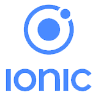

<h2 align="center"> Hey there! I'm Aridane Martín. </h2>

<h3 align="left"> 👨🏻‍💻 About Me </h3>

🌱 &nbsp;Based in Canary Islands, Spain. 
💼 &nbsp;Working on an exciting project for a german company as a Front-end developer. 
🔭 &nbsp;Currently deepening in NodeJS architecture 
🛩 &nbsp;Enthusiast in exploring new technologies and developing software solutions.  
🼠&nbsp;Listening and playing music bring me peace. 

<h2 align="left"><a href="https://www.aridanemartin.dev/">👉 www.aridanemartin.dev</a></h2>

 

<h2 align="center">
  👷🏼 Here are some technologies I use at work:
</h2>

 &nbsp;&nbsp;
 &nbsp;&nbsp;
 &nbsp;&nbsp;
 &nbsp;&nbsp;
 &nbsp;&nbsp;

 &nbsp;&nbsp;
 &nbsp;&nbsp;
 &nbsp;&nbsp;
 &nbsp;&nbsp;
<!--img height="50" src="https://github.com/chandan-reddy-k/chandan-reddy-k/blob/master/assets/graphql.png"--> &nbsp;&nbsp;

 &nbsp;&nbsp;
 &nbsp;&nbsp;
 &nbsp;&nbsp;

<h2 align="center">
  📚 Here are some interesting libraries/design systems I have been working with:
</h2>

 &nbsp;&nbsp;
 &nbsp;&nbsp;
 &nbsp;&nbsp;
 &nbsp;&nbsp;
 &nbsp;&nbsp;
  

 

<h2 align="center">⬇ Connect with Me ⬇</h2>
<h1 align="center">
&nbsp; <a href="https://www.aridanemartin.dev" target="_blank" rel="noopener noreferrer"><strong>www.aridanemartin.dev</strong></a>  
</h1>
<h2 align="center">... or just take a look of my code just down below!</h2>

